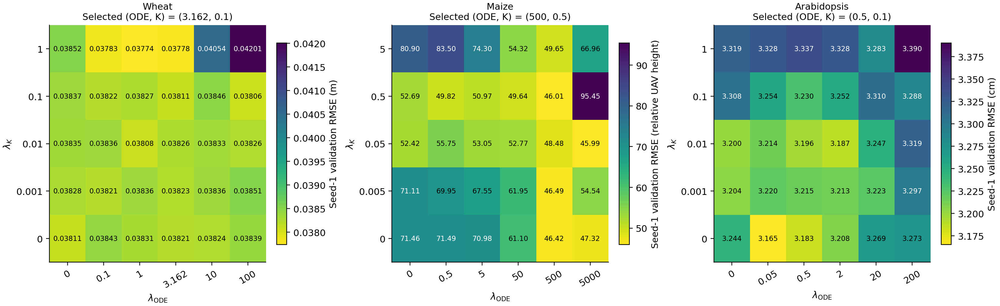
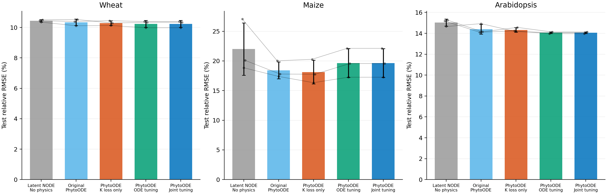

# Joint tuning of the PhytoODE physics coefficients

**The joint search retains the previous ODE-coefficient-tuned pair for Wheat, Maize, Arabidopsis. No newly confirmed three-seed pair improves mean validation RMSE for these datasets. Their selected checkpoints and test results are unchanged. This is a result within the stated search budget, not proof of a global optimum.**

Both lambda_ODE and lambda_K were varied. The main no-physics baseline sets both coefficients to zero and retains the same latent ODE, initial weights and optimizer weight decay. K-only and ODE-only boundaries were included in the search.

Completed 112 new full-length trials in 2.24 hours, reusing the previous validation records. Each dataset screened a 6-by-5 Cartesian grid with seed 1, followed by four geometric corner refinements around the best both-positive pair. The three best both-positive pairs and the best pair on each one-loss boundary were confirmed with seeds 2 and 3. All three-seed candidates, including historical controls, entered the final validation ranking.

The selected PhytoODE is the both-positive pair with the lowest three-seed mean validation RMSE. The unrestricted validation winner is also reported, even if a coefficient is zero. Test error did not determine either selection. All dataset selections and checkpoint hashes were frozen before the selected final evaluations.

**The same test sets had already been inspected during earlier experiments. These are follow-up results on reused test sets, not independent confirmation.** Architecture, optimizer, epoch budgets and validation checkpoint rules remain fixed. The no-physics baseline was not independently retuned.

| Dataset | Original (ODE, K) | Previous ODE tuning (ODE, K) | Selected joint tuning (ODE, K) | Overall validation winner (ODE, K) |
|---|---:|---:|---:|---:|
| Wheat | (2, 0.1) | (3.16228, 0.1) | (3.16228, 0.1) | (3.16228, 0.1) |
| Maize | (0.5, 0.5) | (500, 0.5) | (500, 0.5) | (500, 0.5) |
| Arabidopsis | (2, 0.1) | (0.5, 0.1) | (0.5, 0.1) | (0.5, 0.1) |

The best newly trained both-positive pairs with all three seeds are compared below. The retained candidates also have three seeds. Smaller seed-1 screening errors do not necessarily yield smaller three-seed means.

| Dataset | Best new pair (ODE, K) | New validation RMSE ± SD | Selected validation RMSE ± SD |
|---|---:|---:|---:|
| Wheat | (0.707107, 0.316228) | 0.03817 ± 0.00186 | 0.03768 ± 0.00077 |
| Maize | (500, 0.005) | 49.83 ± 6.44 | 44.94 ± 3.14 |
| Arabidopsis | (1.41421, 0.0316228) | 3.222 ± 0.026 | 3.191 ± 0.033 |

## Train / validation / test

Cells are **RMSE ± sample SD / relative RMSE (%) ± sample SD**, for seeds 1--3. Bold marks the lowest mean among the displayed variants within each dataset and split. Relative RMSE is the mean per-curve RMSE divided by the mean scored target for that split, times 100; it is not MAPE. Wheat is measured in metres, Arabidopsis in centimetres, and maize in relative UAV-height target units (not percentages).

| Dataset | Model | Train | Validation | Test |
|---|---|---:|---:|---:|
| Wheat | Latent Neural ODE (no physics) | **0.02108 ± 0.00006 / 7.04 ± 0.02** | 0.03834 ± 0.00087 / 11.50 ± 0.26 | 0.03091 ± 0.00023 / 10.44 ± 0.08 |
| Wheat | Original PhytoODE | 0.02244 ± 0.00019 / 7.50 ± 0.06 | 0.03804 ± 0.00067 / 11.41 ± 0.20 | 0.03063 ± 0.00062 / 10.34 ± 0.21 |
| Wheat | PhytoODE (K loss only) | 0.02253 ± 0.00016 / 7.53 ± 0.05 | 0.03775 ± 0.00100 / 11.33 ± 0.30 | 0.03047 ± 0.00047 / 10.29 ± 0.16 |
| Wheat | PhytoODE (ODE coefficient tuned) | 0.02231 ± 0.00007 / 7.45 ± 0.02 | **0.03768 ± 0.00077 / 11.30 ± 0.23** | **0.03032 ± 0.00066 / 10.24 ± 0.22** |
| Wheat | PhytoODE (joint tuning) | 0.02231 ± 0.00007 / 7.45 ± 0.02 | **0.03768 ± 0.00077 / 11.30 ± 0.23** | **0.03032 ± 0.00066 / 10.24 ± 0.22** |
| Maize | Latent Neural ODE (no physics) | 43.25 ± 5.76 / 13.86 ± 1.85 | 60.75 ± 10.03 / 23.97 ± 3.96 | 67.78 ± 13.62 / 22.00 ± 4.42 |
| Maize | Original PhytoODE | 41.90 ± 14.37 / 13.43 ± 4.61 | 47.25 ± 2.60 / 18.64 ± 1.03 | 56.68 ± 4.37 / 18.40 ± 1.42 |
| Maize | PhytoODE (K loss only) | **38.09 ± 8.62 / 12.21 ± 2.76** | 48.14 ± 4.53 / 18.99 ± 1.79 | **55.83 ± 6.15 / 18.12 ± 2.00** |
| Maize | PhytoODE (ODE coefficient tuned) | 39.20 ± 3.40 / 12.56 ± 1.09 | **44.94 ± 3.14 / 17.73 ± 1.24** | 60.53 ± 7.50 / 19.65 ± 2.43 |
| Maize | PhytoODE (joint tuning) | 39.20 ± 3.40 / 12.56 ± 1.09 | **44.94 ± 3.14 / 17.73 ± 1.24** | 60.53 ± 7.50 / 19.65 ± 2.43 |
| Arabidopsis | Latent Neural ODE (no physics) | **1.188 ± 0.028 / 5.64 ± 0.13** | 3.278 ± 0.047 / 16.28 ± 0.23 | 2.993 ± 0.066 / 15.03 ± 0.33 |
| Arabidopsis | Original PhytoODE | 1.401 ± 0.088 / 6.66 ± 0.42 | 3.246 ± 0.006 / 16.12 ± 0.03 | 2.866 ± 0.093 / 14.39 ± 0.47 |
| Arabidopsis | PhytoODE (K loss only) | 1.416 ± 0.060 / 6.73 ± 0.29 | 3.241 ± 0.109 / 16.10 ± 0.54 | 2.852 ± 0.043 / 14.32 ± 0.22 |
| Arabidopsis | PhytoODE (ODE coefficient tuned) | 1.421 ± 0.030 / 6.75 ± 0.14 | **3.191 ± 0.033 / 15.85 ± 0.16** | **2.800 ± 0.016 / 14.06 ± 0.08** |
| Arabidopsis | PhytoODE (joint tuning) | 1.421 ± 0.030 / 6.75 ± 0.14 | **3.191 ± 0.033 / 15.85 ± 0.16** | **2.800 ± 0.016 / 14.06 ± 0.08** |

## Paired test comparisons

Positive reduction means lower test RMSE after joint tuning.

| Dataset | Reference | Error reduction (%) | Seeds with lower error |
|---|---|---:|---:|
| Wheat | Latent Neural ODE (no physics) | +1.91% | 3/3 |
| Wheat | Original PhytoODE | +1.00% | 3/3 |
| Wheat | PhytoODE (K loss only) | +0.49% | 2/3 |
| Wheat | PhytoODE (ODE coefficient tuned) | +0.00% | 0/3 |
| Maize | Latent Neural ODE (no physics) | +10.70% | 3/3 |
| Maize | Original PhytoODE | -6.78% | 1/3 |
| Maize | PhytoODE (K loss only) | -8.40% | 0/3 |
| Maize | PhytoODE (ODE coefficient tuned) | +0.00% | 0/3 |
| Arabidopsis | Latent Neural ODE (no physics) | +6.46% | 3/3 |
| Arabidopsis | Original PhytoODE | +2.31% | 3/3 |
| Arabidopsis | PhytoODE (K loss only) | +1.85% | 3/3 |
| Arabidopsis | PhytoODE (ODE coefficient tuned) | +0.00% | 0/3 |



Each cell shows seed-1 validation RMSE for a prespecified coarse-grid pair, with separate colour scales by dataset. The title gives the final three-seed selection, which may be a refined or historical pair outside the displayed grid. All additional candidates and their seed counts are in validation_trials.csv and validation_summary.csv. A favourable seed-1 cell alone does not determine the final selection.



Bars show mean test relative RMSE with sample SD. Connected points represent the same initialization seed across variants. These three seeds quantify initialization variability, not variation across independent seasons or experiments.

Wheat preserves the original scoring mask, including 475 initial-fill points among 1,368 test points. Maize scores the original relative UAV-height targets and uses the original training-only normalization. Arabidopsis holds out plants within known genotype/temperature combinations and scores four observations per curve. These constraints limit claims about generalization to unseen genotypes or independent environments.

The coefficients multiply losses with different dimensions: the data term is RMSE, the ODE term is squared height-per-day residual, and the K term is absolute maximum-height consistency, all in each model's internal height scale. Large numerical coefficients therefore do not by themselves imply stronger gradient influence. loss_contributions.csv records weighted terms just before the selected epoch's optimizer step.

## Reproduction and artifacts

```bash
.venv/bin/python experiments/tune_joint_lambdas.py --output experiments/results/joint_lambda_repeat
.venv/bin/python experiments/joint_lambda_status.py --output experiments/results/joint_lambda_repeat
# If interrupted, use the same folder and add --resume to the training controller.
.venv/bin/python experiments/summarize_joint_lambdas.py --output experiments/results/joint_lambda_repeat
```

The launcher checks historical full-model and both-zero training prefixes, plus bitwise equality of a resumed and uninterrupted 20-epoch run, before each dataset search. Trial state includes optimizer, scheduler and all RNG states. Completed trials and frozen adaptive candidate lists are reused on resume. Ephemeral resume states and diagnostic tensors stay local; selected checkpoints, predictions, compact histories and manifests are versioned.

selected_config.json stores the effective selected coefficients and unchanged training settings. validation.json audits source/data hashes, paired initialization, full training budgets, validation selection and prediction-derived metrics. joint_lambda_table.tex requires booktabs and graphicx; resizebox limits the width to the current line. The baseline comparison is in all_baselines.md. Earlier reports are preserved as separate experiments.
