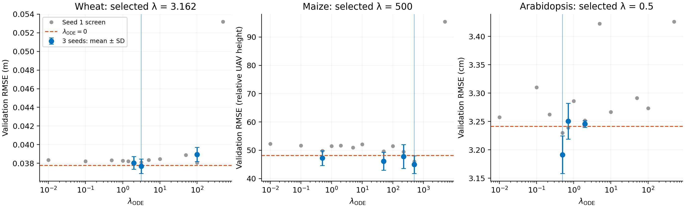
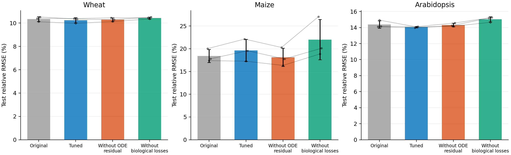

# Validation-selected ODE-residual coefficient tuning

**Against the zero-residual model, the validation-selected positive coefficient lowers mean test error for Wheat, Arabidopsis. It raises mean test error for Maize; tuning does not make the ODE-residual model uniformly best on test.**

Only the logistic derivative-residual coefficient was varied. Architecture, paired initialization, maximum-height coefficient, optimizer, schedule, training length, data splits, masks and validation checkpoint rules match the previous ablation.

Completed 47 new full-length training trials in 1.47 hours, followed by nine final evaluations. Wheat and Arabidopsis ran concurrently on GPU 2; maize used GPU 3.

## Search and selection

The fixed positive grid was 0.01, 0.1, 0.5, 1, 2, 5, 10, 50, 100 and 500. Original positive-coefficient and zero-residual results were reused. Seed 1 screened the grid, followed by one refinement using geometric midpoints around its best positive validation coefficient (one decade outward at a grid boundary). The three best positive seed-1 candidates were confirmed with seeds 2 and 3. All coefficients with three seeds, including zero and the original coefficient, entered the final validation ranking. The positive coefficient with the lowest mean validation RMSE was selected; the overall winner including zero is reported separately.

No new candidate was evaluated on test during search. All three dataset selections and checkpoint hashes were frozen before any final test evaluation. **The previous ablation's test results had already been inspected before this follow-up search: these are reused-test follow-up scores, not an independent confirmation.**

| Dataset | Original ODE coefficient | Selected positive coefficient | Overall validation winner (including zero) | Fixed maximum-height coefficient |
|---|---:|---:|---:|---:|
| Wheat | 2 | 3.16228 | 3.16228 | 0.1 |
| Maize | 0.5 | 500 | 500 | 0.5 |
| Arabidopsis | 2 | 0.5 | 0.5 | 0.1 |

### Interrupted-run recovery

The original controller and one wheat confirmation run received termination signals of unidentified origin. The incomplete wheat run (coefficient 3.162277660, seed 2) stopped at epoch 578 and was excluded. The 45 completed trials and two frozen dataset selections were retained. The interrupted run was restarted from the same seed for the full 1,500 epochs, and the still-pending seed-3 run was completed. The recorded interrupted prefix matches the replacement run. No optimizer, architecture, coefficient candidate, ranking rule or test policy changed. `recovery.json` retains the interrupted prefix and records the recovery procedure; `recovery_completed.json` records completion. The original frozen training/controller sources remain unchanged.



The gray points show seed-1 screening values. Blue points and error bars show the mean and sample SD for coefficients evaluated with all three seeds. The dashed line is the three-seed mean at zero; the selected positive coefficient is marked. A screened candidate with only one seed is not eligible for final selection.

## Train / validation / test

Cells are **RMSE ± sample SD / relative RMSE (%) ± sample SD**, across seeds 1--3. Bold denotes the lowest mean among these four variants within each dataset and split. Relative RMSE is curve-averaged RMSE divided by the split's mean scored target, multiplied by 100; it is not MAPE. Maize relative UAV-height units are the target units and should not be confused with relative RMSE.

| Dataset (RMSE unit) | Variant | Train | Validation | Test |
|---|---|---:|---:|---:|
| Wheat (m) | Original PhytoODE | 0.02244 ± 0.00019 / 7.50 ± 0.06 | 0.03804 ± 0.00067 / 11.41 ± 0.20 | 0.03063 ± 0.00062 / 10.34 ± 0.21 |
| Wheat (m) | Tuned PhytoODE | 0.02231 ± 0.00007 / 7.45 ± 0.02 | **0.03768 ± 0.00077 / 11.30 ± 0.23** | **0.03032 ± 0.00066 / 10.24 ± 0.22** |
| Wheat (m) | Without ODE residual | 0.02253 ± 0.00016 / 7.53 ± 0.05 | 0.03775 ± 0.00100 / 11.33 ± 0.30 | 0.03047 ± 0.00047 / 10.29 ± 0.16 |
| Wheat (m) | Without biological losses | **0.02108 ± 0.00006 / 7.04 ± 0.02** | 0.03834 ± 0.00087 / 11.50 ± 0.26 | 0.03091 ± 0.00023 / 10.44 ± 0.08 |
| Maize (relative UAV height) | Original PhytoODE | 41.90 ± 14.37 / 13.43 ± 4.61 | 47.25 ± 2.60 / 18.64 ± 1.03 | 56.68 ± 4.37 / 18.40 ± 1.42 |
| Maize (relative UAV height) | Tuned PhytoODE | 39.20 ± 3.40 / 12.56 ± 1.09 | **44.94 ± 3.14 / 17.73 ± 1.24** | 60.53 ± 7.50 / 19.65 ± 2.43 |
| Maize (relative UAV height) | Without ODE residual | **38.09 ± 8.62 / 12.21 ± 2.76** | 48.14 ± 4.53 / 18.99 ± 1.79 | **55.83 ± 6.15 / 18.12 ± 2.00** |
| Maize (relative UAV height) | Without biological losses | 43.25 ± 5.76 / 13.86 ± 1.85 | 60.75 ± 10.03 / 23.97 ± 3.96 | 67.78 ± 13.62 / 22.00 ± 4.42 |
| Arabidopsis (cm) | Original PhytoODE | 1.401 ± 0.088 / 6.66 ± 0.42 | 3.246 ± 0.006 / 16.12 ± 0.03 | 2.866 ± 0.093 / 14.39 ± 0.47 |
| Arabidopsis (cm) | Tuned PhytoODE | 1.421 ± 0.030 / 6.75 ± 0.14 | **3.191 ± 0.033 / 15.85 ± 0.16** | **2.800 ± 0.016 / 14.06 ± 0.08** |
| Arabidopsis (cm) | Without ODE residual | 1.416 ± 0.060 / 6.73 ± 0.29 | 3.241 ± 0.109 / 16.10 ± 0.54 | 2.852 ± 0.043 / 14.32 ± 0.22 |
| Arabidopsis (cm) | Without biological losses | **1.188 ± 0.028 / 5.64 ± 0.13** | 3.278 ± 0.047 / 16.28 ± 0.23 | 2.993 ± 0.066 / 15.03 ± 0.33 |



Bars show three-seed means and sample SD; paired points connect the same initialization seed. All four variants retain the latent Neural ODE architecture. The zero-residual variant retains the maximum-height penalty; the final variant removes both biological losses. If the search retains the original coefficient, original and tuned rows use the same reevaluated checkpoints and scores; scorer-rounding differences are not counted as improvements.

## Paired test comparisons

Positive error reduction means the tuned model has lower mean error.

| Dataset | Reference | Error reduction (%) | Seeds favoring tuned model |
|---|---|---:|---:|
| Wheat | Original PhytoODE | +1.00 | 3/3 |
| Wheat | Without ODE residual | +0.49 | 2/3 |
| Wheat | Without biological losses | +1.91 | 3/3 |
| Maize | Original PhytoODE | -6.78 | 1/3 |
| Maize | Without ODE residual | -8.40 | 0/3 |
| Maize | Without biological losses | +10.70 | 3/3 |
| Arabidopsis | Original PhytoODE | +2.31 | 3/3 |
| Arabidopsis | Without ODE residual | +1.85 | 3/3 |
| Arabidopsis | Without biological losses | +6.46 | 3/3 |

Three seeds measure initialization variation, not uncertainty across independent years or experiments. This comparison alone does not establish statistical significance or superiority of the latent ODE architecture over a model without an ODE. Single held-out years and previously seen test scores limit generalization claims. Wheat preserves the original initial-fill scoring mask (475 of 1,368 test points are pre-observation fill); maize and Arabidopsis score observed points only. Arabidopsis holds out plants within known genotype/temperature combinations.

The broader baseline table is in [all_baselines.md](all_baselines.md). Baselines reuse their existing frozen results and were not rerun or retuned here. The original manuscript figures and tables remain available separately.

## Reproduction

From the repository root, use a fresh output directory:

```bash
.venv/bin/python experiments/tune_lambda_ode.py --short-gpu 2 --long-gpu 3 --maize-workers 2 --output experiments/results/lambda_ode_repeat
.venv/bin/python experiments/summarize_lambda_ode.py --output experiments/results/lambda_ode_repeat
```

Each dataset's `selected_config.json` contains the selected effective coefficient, unchanged training settings and checkpoint references. `selected.json` records the validation ranking and frozen checkpoint hashes; `validation.json` audits every completed trial and recomputes final metrics from predictions. Original full and zero-coefficient references are reused from the preceding experiments, and all new training trials contain train/validation metrics only.

`loss_contributions.csv` records raw and weighted ODE losses for new trials at their selected epoch, from the training objective immediately before that epoch's optimizer step. These loss magnitudes help interpret the numerical coefficient but do not measure gradient influence. In the model's internal height scale (normalized heights for maize), the residual is a squared error in height-per-day units, while the data term is RMSE in height units, so coefficient magnitude alone does not describe constraint strength.
