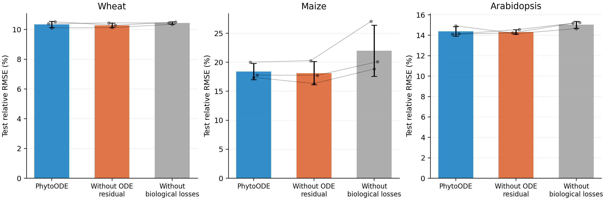

# PhytoODE physics-loss ablation

Three fixed seeds (1--3), paired initialization, unchanged model architecture and dataset-specific training/validation rules. Full PhytoODE rows reuse the frozen manuscript runs. A fresh full-model seed-1 control reproduces the selected epoch and all three split errors for each dataset.

## Loss definitions

- **PhytoODE:** data loss + logistic ODE residual + maximum-height consistency loss.
- **Without ODE residual:** set only the logistic derivative-residual coefficient to zero; keep the maximum-height consistency loss.
- **Without biological losses:** set both coefficients to zero; train with data loss and the same optimizer weight decay. This is the pure data-trained latent ODE comparison.

The auxiliary logistic parameter head is retained to preserve the architecture and random-number sequence. It does not affect predictions, and receives no gradients in the pure-data variant. The genotype embedding, temperature encoder, latent ODE, decoder, optimizer, learning-rate schedule, data splits and masks are identical across variants. There is no ablation-specific hyperparameter search.

| Dataset | Epochs | ODE residual weight | Maximum-height weight | Checkpoint selection |
|---|---:|---:|---:|---|
| Wheat | 1,500 | 2.0 | 0.1 | 10-evaluation moving mean, eligible from epoch 600 |
| Maize | 3,000 | 0.5 | 0.5 | Minimum validation RMSE, evaluated every 10 epochs |
| Arabidopsis | 1,500 | 2.0 | 0.1 | 10-evaluation moving mean, eligible from epoch 300 |

## Train / validation / test comparison

Each cell is **RMSE ± sample SD / relative error (%) ± sample SD**. The lowest mean within each dataset and split is bold. Relative error = curve-averaged RMSE / mean scored target of that split × 100; this is not MAPE.

| Dataset (RMSE unit) | Model | Train | Validation | Test |
|---|---|---:|---:|---:|
| Wheat (m) | PhytoODE | 0.02244 ± 0.00019 / 7.50 ± 0.06 | 0.03804 ± 0.00067 / 11.41 ± 0.20 | 0.03063 ± 0.00062 / 10.34 ± 0.21 |
| Wheat (m) | Without ODE residual | 0.02253 ± 0.00016 / 7.53 ± 0.05 | **0.03775 ± 0.00100 / 11.33 ± 0.30** | **0.03047 ± 0.00047 / 10.29 ± 0.16** |
| Wheat (m) | Without biological losses | **0.02108 ± 0.00006 / 7.04 ± 0.02** | 0.03834 ± 0.00087 / 11.50 ± 0.26 | 0.03091 ± 0.00023 / 10.44 ± 0.08 |
| Maize (relative UAV height) | PhytoODE | 41.90 ± 14.37 / 13.43 ± 4.61 | **47.25 ± 2.60 / 18.64 ± 1.03** | 56.68 ± 4.37 / 18.40 ± 1.42 |
| Maize (relative UAV height) | Without ODE residual | **38.09 ± 8.62 / 12.21 ± 2.76** | 48.14 ± 4.53 / 18.99 ± 1.79 | **55.83 ± 6.15 / 18.12 ± 2.00** |
| Maize (relative UAV height) | Without biological losses | 43.25 ± 5.76 / 13.86 ± 1.85 | 60.75 ± 10.03 / 23.97 ± 3.96 | 67.78 ± 13.62 / 22.00 ± 4.42 |
| Arabidopsis (cm) | PhytoODE | 1.401 ± 0.088 / 6.66 ± 0.42 | 3.246 ± 0.006 / 16.12 ± 0.03 | 2.866 ± 0.093 / 14.39 ± 0.47 |
| Arabidopsis (cm) | Without ODE residual | 1.416 ± 0.060 / 6.73 ± 0.29 | **3.241 ± 0.109 / 16.10 ± 0.54** | **2.852 ± 0.043 / 14.32 ± 0.22** |
| Arabidopsis (cm) | Without biological losses | **1.188 ± 0.028 / 5.64 ± 0.13** | 3.278 ± 0.047 / 16.28 ± 0.23 | 2.993 ± 0.066 / 15.03 ± 0.33 |

## Test-error changes relative to full PhytoODE

Positive values mean that removing a loss increases error. Negative values mean that the ablated model performs better.

| Dataset | Ablation | RMSE change | Error change (%) | Seeds with lower error for full PhytoODE |
|---|---|---:|---:|---:|
| Wheat | Without ODE residual | -0.00016 | -0.51 | 2/3 |
| Wheat | Without biological losses | +0.00028 | +0.93 | 2/3 |
| Maize | Without ODE residual | -0.85098 | -1.50 | 1/3 |
| Maize | Without biological losses | +11.09704 | +19.58 | 3/3 |
| Arabidopsis | Without ODE residual | -0.01363 | -0.48 | 2/3 |
| Arabidopsis | Without biological losses | +0.12718 | +4.44 | 2/3 |



## Interpretation limits

The error bars show variation across initialization seeds, not independent years or a biological confidence interval. Three seeds do not establish statistical significance. Settings were originally selected for the full model; this measures removal of losses at those fixed settings, not the best achievable accuracy after independently tuning each ablation. A single held-out year is used for wheat and maize. Arabidopsis holds out plants within known genotypes and temperatures. The wheat scoring mask retains the original pre-observation fill points (475 of 1,368 test points); the other datasets score observed points only.

The ODE-residual-only ablation isolates the derivative constraint conditional on the maximum-height term. The pure-data comparison measures the joint effect of both biological penalties. It cannot attribute the entire difference specifically to the ODE residual.

## Reproduction

From the repository root, using a new output directory:

```bash
.venv/bin/python experiments/run_physics_ablation.py --gpus 0 2 3 --output experiments/results/physics_ablation_repeat
.venv/bin/python experiments/summarize_physics_ablation.py --output experiments/results/physics_ablation_repeat
```

Outputs include per-seed and aggregate metrics, paired changes, selected epochs, full-model reproduction checks, initialization hashes, validation histories, frozen selection records, checkpoints and all-split predictions. The original manuscript tables and figures are preserved.
