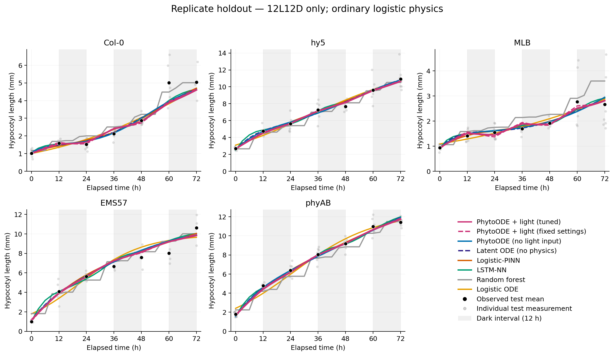
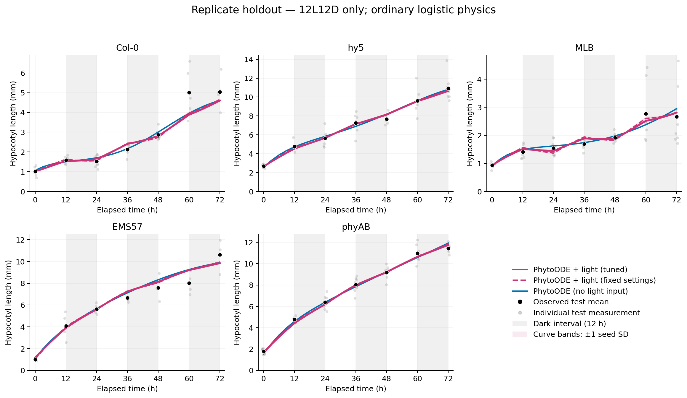
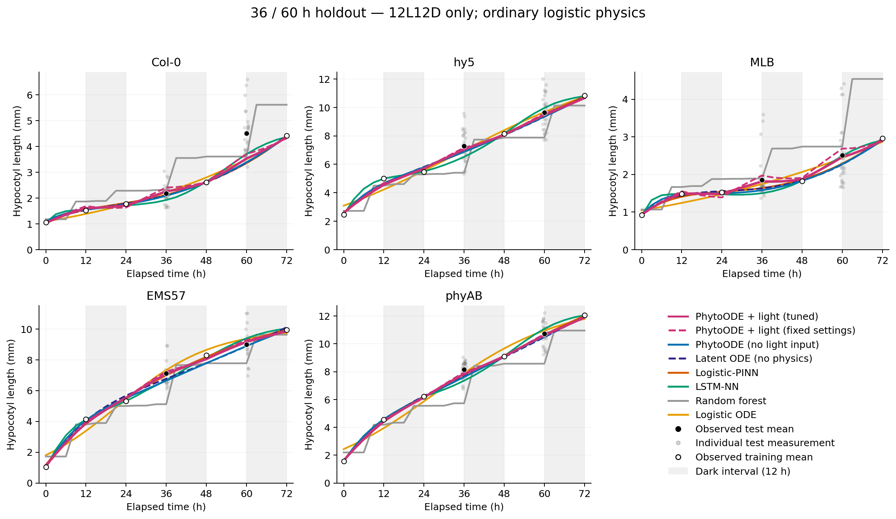
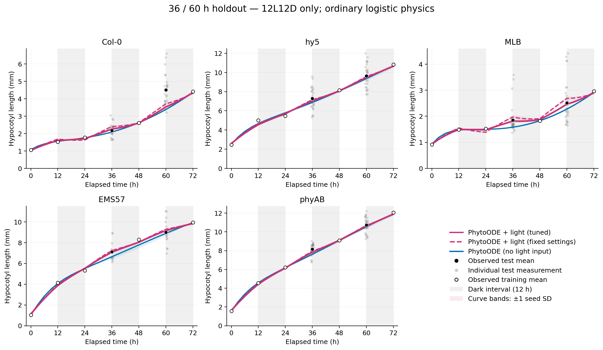

# PhytoODE with binary light input: 12L12D-only follow-up

Only PhytoODE is newly trained. All earlier baseline predictions and scores are retained exactly. cR is excluded; temperature is fixed at 23°C and is not supplied as a feature. The partitions and split-specific mean targets are unchanged. No missing phenotype is filled in.

The new model receives genotype, normalized elapsed time, and one known binary light state: on = 1 for [0,12), [24,36), [48,60) h; off = 0 for [12,24), [36,48), [60,72) h. The endpoint at 72 h is the next on state. The encoder reads the known schedule, never a height observation. The latent vector field receives the instantaneous light state.

Physics remains the ordinary logistic residual dh/dt - r_g h (1-h/K_g), with one constant r and K per genotype, plus the original finite-window capacity penalty. There are no separate light/dark logistic rates. The decoder chain rule computes dh/dt = (partial h/partial z) f(z,g,t,L)/72 by automatic differentiation. RK4 holds illumination constant within each interval and changes it at the 12 h boundaries. The original 23 interior physics nodes are retained, using the right-hand derivative at switching times. No derivative of a measured length or of the binary switch is required. Hidden widths are unchanged; adding the channel increases the parameter count from 1,055 to 1,103.

Each protocol screens 32 fixed seed-1 configurations: the 16 previous PhytoODE grid combinations plus 16 preregistered stratified log-space samples of learning rate, lambda_ODE, lambda_K, and weight decay. All fits run 1,500 epochs. The best three seed-1 candidates, plus the prior-selected no-light hyperparameter anchor if needed, are confirmed with seeds 2 and 3. The tuned variant minimizes mean validation RMSE among confirmed candidates. Both protocols freeze selections before any current test scoring. Checkpoints minimize the trailing three validation evaluations after epoch 200; the complete history is exported through epoch 1,500.

Completed 80 new fits and 12 final evaluations. The fixed-settings variant uses all previously selected no-light PhytoODE hyperparameters and the same three seed labels. Adding an input changes the weight-matrix dimensions and initialization, so this is not an identical-initial-weight ablation. The tuned variant additionally receives a larger search budget than the retained baselines. Earlier results on these same partitions have been inspected; this follow-up is not an independent new test cohort. No search extension was made after the current test scores were computed.

All plants share one predetermined 12L12D schedule, so illumination is a deterministic function of elapsed time. Adding it supplies an explicit phase feature, not independent evidence of a causal light response or transfer to a different photoperiod.

Primary RMSE (mm) is the mean of five genotype-curve RMSEs against split-specific replicate means. Relative RMSE is 100 × that RMSE / the mean of the scored replicate-mean targets; it is not MAPE. Table entries average per-seed metrics; they are not scores of an ensemble. SD measures training-seed variability and is not a confidence interval or a test of significance. Individual-measurement RMSE is saved separately in the CSV.

## replicate

Raw measurements train / validation / test: 547 / 171 / 225; mean targets: 35 / 35 / 35.

| Model | Train RMSE / rRMSE | Validation RMSE / rRMSE | Test RMSE / rRMSE |
|---|---|---|---|
| PhytoODE + light (tuned) | 0.1904 ± 0.0077 / 3.75 ± 0.15% | **0.2777 ± 0.0011 / 5.48 ± 0.02%** | 0.3460 ± 0.0077 / 6.85 ± 0.15% |
| PhytoODE + light (fixed settings) | 0.1713 ± 0.0106 / 3.38 ± 0.21% | 0.2886 ± 0.0068 / 5.70 ± 0.13% | **0.3293 ± 0.0057 / 6.52 ± 0.11%** |
| PhytoODE (no light input) | 0.1910 ± 0.0020 / 3.76 ± 0.04% | 0.2926 ± 0.0008 / 5.78 ± 0.02% | 0.3646 ± 0.0079 / 7.22 ± 0.16% |
| Latent ODE (no physics) | 0.1903 ± 0.0074 / 3.75 ± 0.15% | 0.2965 ± 0.0030 / 5.86 ± 0.06% | 0.3679 ± 0.0070 / 7.28 ± 0.14% |
| Logistic-PINN | 0.2194 ± 0.0134 / 4.32 ± 0.26% | 0.3039 ± 0.0022 / 6.00 ± 0.04% | 0.3607 ± 0.0136 / 7.14 ± 0.27% |
| LSTM-NN | **0.1374 ± 0.0295 / 2.71 ± 0.58%** | 0.2877 ± 0.0142 / 5.68 ± 0.28% | 0.3613 ± 0.0072 / 7.15 ± 0.14% |
| Random forest | 0.3640 ± 0.0133 / 7.17 ± 0.26% | 0.4724 ± 0.0269 / 9.33 ± 0.53% | 0.4523 ± 0.0139 / 8.95 ± 0.28% |
| Logistic ODE | 0.3702 / 7.29% | 0.4084 / 8.07% | 0.4852 / 9.61% |
| Latent ODE (matched to no-light PhytoODE) | 0.1903 ± 0.0074 / 3.75 ± 0.15% | 0.2965 ± 0.0030 / 5.86 ± 0.06% | 0.3679 ± 0.0070 / 7.28 ± 0.14% |

Selected light-input settings: lr=0.01, lambda_ode=500, lambda_k=0.1, weight_decay=0.0001.

The fixed-settings light-input variant has a lower test RMSE than the validation-selected tuned variant. This does not change the frozen validation selection: the fixed-settings row is a prespecified feature comparison, not a model chosen afterward by test performance.

Lowest observed test mean: PhytoODE + light (fixed settings). This ranking alone does not establish statistical superiority.

Curves average predictions across three seeds; the process logistic ODE has one fit. Black circles are observed test means. Faint gray points are individual test measurements, with deterministic horizontal jitter for visibility. For the 36/60-h holdout, open circles show training means. Shaded vertical intervals denote darkness, not missing data. The previously matched no-physics control is included in the table but omitted from the multi-model plot to reduce overlap.

The focused plot compares no light input, light input at fixed previous settings (dashed), and tuned light input (solid). Curve bands show ±1 SD across seeds; they are not measurement uncertainty.

## time_holdout

Raw measurements train / validation / test: 397 / 125 / 257; mean targets: 25 / 25 / 10.

| Model | Train RMSE / rRMSE | Validation RMSE / rRMSE | Test RMSE / rRMSE |
|---|---|---|---|
| PhytoODE + light (tuned) | 0.1315 ± 0.0140 / 2.87 ± 0.31% | **0.2668 ± 0.0007 / 5.87 ± 0.01%** | 0.2658 ± 0.0262 / 4.22 ± 0.42% |
| PhytoODE + light (fixed settings) | 0.1384 ± 0.0328 / 3.03 ± 0.72% | 0.2753 ± 0.0124 / 6.05 ± 0.27% | **0.2413 ± 0.0106 / 3.83 ± 0.17%** |
| PhytoODE (no light input) | 0.1435 ± 0.0333 / 3.14 ± 0.73% | 0.2685 ± 0.0055 / 5.90 ± 0.12% | 0.4419 ± 0.0857 / 7.01 ± 1.36% |
| Latent ODE (no physics) | 0.1459 ± 0.0046 / 3.19 ± 0.10% | 0.2825 ± 0.0153 / 6.21 ± 0.34% | 0.4114 ± 0.0486 / 6.53 ± 0.77% |
| Logistic-PINN | 0.1136 ± 0.0162 / 2.48 ± 0.35% | 0.2887 ± 0.0120 / 6.35 ± 0.26% | 0.3809 ± 0.0203 / 6.05 ± 0.32% |
| LSTM-NN | **0.0578 ± 0.0457 / 1.26 ± 1.00%** | 0.2922 ± 0.0080 / 6.43 ± 0.18% | 0.5025 ± 0.0872 / 7.97 ± 1.38% |
| Random forest | 0.6402 ± 0.0262 / 14.00 ± 0.57% | 0.6264 ± 0.0381 / 13.78 ± 0.84% | 1.3224 ± 0.0255 / 20.99 ± 0.40% |
| Logistic ODE | 0.3671 / 8.03% | 0.4511 / 9.92% | 0.3110 / 4.94% |
| Latent ODE (matched to no-light PhytoODE) | 0.0999 ± 0.0232 / 2.19 ± 0.51% | 0.2908 ± 0.0126 / 6.40 ± 0.28% | 0.4476 ± 0.0084 / 7.10 ± 0.13% |

Selected light-input settings: lr=0.01, lambda_ode=500, lambda_k=0.1, weight_decay=0.0001.

The fixed-settings light-input variant has a lower test RMSE than the validation-selected tuned variant. This does not change the frozen validation selection: the fixed-settings row is a prespecified feature comparison, not a model chosen afterward by test performance.

Lowest observed test mean: PhytoODE + light (fixed settings). This ranking alone does not establish statistical superiority.

Curves average predictions across three seeds; the process logistic ODE has one fit. Black circles are observed test means. Faint gray points are individual test measurements, with deterministic horizontal jitter for visibility. For the 36/60-h holdout, open circles show training means. Shaded vertical intervals denote darkness, not missing data. The previously matched no-physics control is included in the table but omitted from the multi-model plot to reduce overlap.

The focused plot compares no light input, light input at fixed previous settings (dashed), and tuned light input (solid). Curve bands show ±1 SD across seeds; they are not measurement uncertainty.
