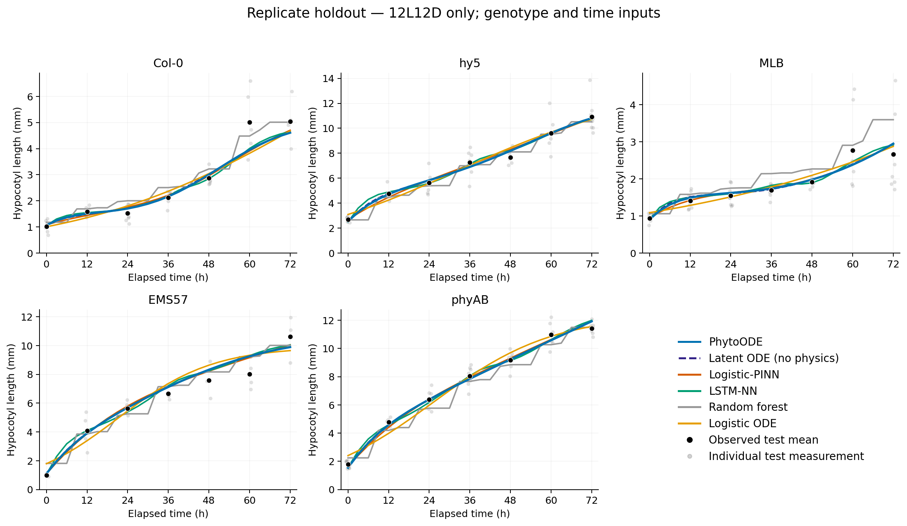
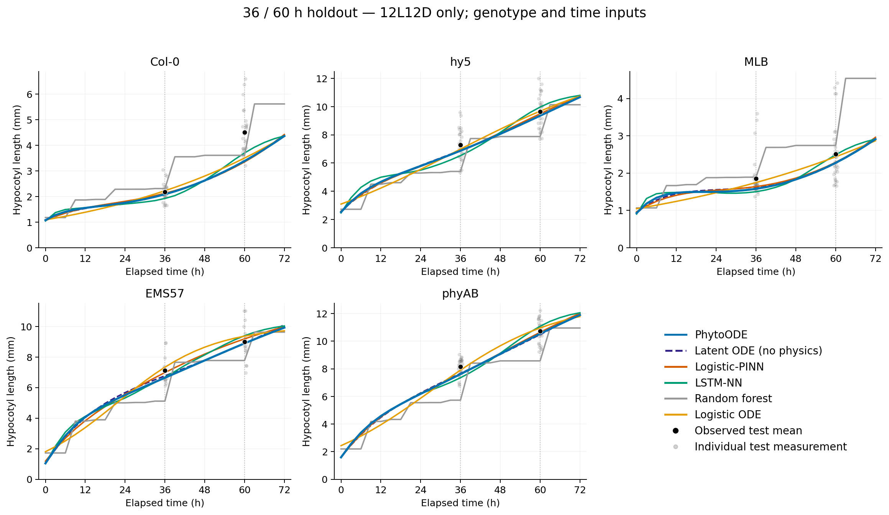

# 12L12D only: genotype/time models with an ordinary logistic reference

cR is excluded. All predictors receive genotype and elapsed time only; no illumination, duty-cycle, accumulated-exposure, spectral, or temperature features are supplied. PhytoODE and Logistic-PINN use a constant-rate logistic derivative residual. The process baseline is the ordinary logistic ODE. All fits are new.

As requested when restoring the initial protocol, training and primary scoring use split-specific replicate means. Missing time groups have no target; no missing phenotype is imputed. Primary RMSE is the mean of five genotype-curve RMSEs; relative RMSE divides it by the mean of the scored group-mean targets. Individual-measurement RMSE is retained separately and is not interchangeable with the primary score.

The original source-row partitions were filtered to 12L12D, without reassignment. Earlier results on these partitions had been inspected. All current selections used validation only and froze before current test scoring. The original search budget gives PhytoODE and Logistic-PINN 16 candidates each, latent ODE and LSTM 2 each, RF 3, and logistic ODE 1 per protocol. The two leading stochastic candidates are confirmed with seeds 2 and 3. A matched no-physics control separates loss effects from independent learning-rate selection.

## replicate

Raw measurements train / validation / test: 547 / 171 / 225. Mean targets: 35 / 35 / 35.

| Model | Train RMSE / rRMSE | Validation RMSE / rRMSE | Test RMSE / rRMSE |
|---|---|---|---|
| PhytoODE | 0.1910 ± 0.0020 / 3.76 ± 0.04% | 0.2926 ± 0.0008 / 5.78 ± 0.02% | 0.3646 ± 0.0079 / 7.22 ± 0.16% |
| Latent ODE (no physics) | 0.1903 ± 0.0074 / 3.75 ± 0.15% | 0.2965 ± 0.0030 / 5.86 ± 0.06% | 0.3679 ± 0.0070 / 7.28 ± 0.14% |
| Logistic-PINN | 0.2194 ± 0.0134 / 4.32 ± 0.26% | 0.3039 ± 0.0022 / 6.00 ± 0.04% | **0.3607 ± 0.0136 / 7.14 ± 0.27%** |
| LSTM-NN | **0.1374 ± 0.0295 / 2.71 ± 0.58%** | **0.2877 ± 0.0142 / 5.68 ± 0.28%** | 0.3613 ± 0.0072 / 7.15 ± 0.14% |
| Random forest | 0.3640 ± 0.0133 / 7.17 ± 0.26% | 0.4724 ± 0.0269 / 9.33 ± 0.53% | 0.4523 ± 0.0139 / 8.95 ± 0.28% |
| Logistic ODE | 0.3702 / 7.29% | 0.4084 / 8.07% | 0.4852 / 9.61% |
| Latent ODE (matched) | 0.1903 ± 0.0074 / 3.75 ± 0.15% | 0.2965 ± 0.0030 / 5.86 ± 0.06% | 0.3679 ± 0.0070 / 7.28 ± 0.14% |

RMSE is in mm. SD describes training-seed variability. Black points in the figure are test replicate means; faint gray points are individual test measurements. Curves average predictions across seeds, except the single-fit logistic ODE.

| Model | Secondary individual-measurement test RMSE (mm) |
|---|---:|
| PhytoODE | 0.7377 |
| Latent ODE (no physics) | 0.7394 |
| Logistic-PINN | 0.7364 |
| LSTM-NN | 0.7387 |
| Random forest | 0.7892 |
| Logistic ODE | 0.8014 |
| Latent ODE (matched) | 0.7394 |

## time_holdout

Raw measurements train / validation / test: 397 / 125 / 257. Mean targets: 25 / 25 / 10.

| Model | Train RMSE / rRMSE | Validation RMSE / rRMSE | Test RMSE / rRMSE |
|---|---|---|---|
| PhytoODE | 0.1435 ± 0.0333 / 3.14 ± 0.73% | **0.2685 ± 0.0055 / 5.90 ± 0.12%** | 0.4419 ± 0.0857 / 7.01 ± 1.36% |
| Latent ODE (no physics) | 0.1459 ± 0.0046 / 3.19 ± 0.10% | 0.2825 ± 0.0153 / 6.21 ± 0.34% | 0.4114 ± 0.0486 / 6.53 ± 0.77% |
| Logistic-PINN | 0.1136 ± 0.0162 / 2.48 ± 0.35% | 0.2887 ± 0.0120 / 6.35 ± 0.26% | 0.3809 ± 0.0203 / 6.05 ± 0.32% |
| LSTM-NN | **0.0578 ± 0.0457 / 1.26 ± 1.00%** | 0.2922 ± 0.0080 / 6.43 ± 0.18% | 0.5025 ± 0.0872 / 7.97 ± 1.38% |
| Random forest | 0.6402 ± 0.0262 / 14.00 ± 0.57% | 0.6264 ± 0.0381 / 13.78 ± 0.84% | 1.3224 ± 0.0255 / 20.99 ± 0.40% |
| Logistic ODE | 0.3671 / 8.03% | 0.4511 / 9.92% | **0.3110 / 4.94%** |
| Latent ODE (matched) | 0.0999 ± 0.0232 / 2.19 ± 0.51% | 0.2908 ± 0.0126 / 6.40 ± 0.28% | 0.4476 ± 0.0084 / 7.10 ± 0.13% |

RMSE is in mm. SD describes training-seed variability. Black points in the figure are test replicate means; faint gray points are individual test measurements. Curves average predictions across seeds, except the single-fit logistic ODE.

| Model | Secondary individual-measurement test RMSE (mm) |
|---|---:|
| PhytoODE | 0.9696 |
| Latent ODE (no physics) | 0.9606 |
| Logistic-PINN | 0.9558 |
| LSTM-NN | 0.9937 |
| Random forest | 1.7427 |
| Logistic ODE | 0.9188 |
| Latent ODE (matched) | 0.9776 |
