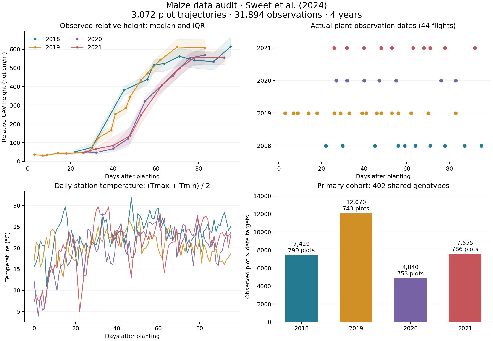

# 옥수수 데이터 검토 및 비교 실험용 전처리

작성일: 2026-09-04. 모든 수치는 실제 내려받은 파일에서 계산했다.
논문: Sweet et al., *The Plant Journal* (2024),
[10.1111/tpj.17092](https://onlinelibrary.wiley.com/doi/10.1111/tpj.17092).

이 문서는 데이터 준비 단계의 기록이다. 이후 완료된 학습 결과는
[모델 비교 보고서](../results/chronological_final_seed1_3/comparison.md)에 있다.

## 준비된 데이터

**네 연도에 모두 관측이 존재하고 시험구를 명확히 식별할 수 있는 402개
유전자형을 선택했다. 총 3,072개 시험구 시계열, 31,894개 실제 관측값이다.**
랜덤한 시간점 분할 없이 연도별로 분리한다. 데이터 준비 단계에서는 모델과
baseline 학습에 앞서 데이터 준비와 모델 입력 호환성을 검증했다.

한 샘플은 개별 식물이 아니라 **한 연도의 한 시험구 성장 시계열**이다.
31,894개 행은 독립 개체 수가 아니라 반복 측정 횟수다.
평균 곡선 단위는 유전자형 × 연도이며 총 1,608개다. 이 중 1,464개는
2개 시험구, 144개는 1개 시험구만 남아 있다. 전체 환경은 4개 연도뿐이다.

| 연도 | 용도 | 유전자형 | 시험구 시계열 | 실제 관측값 | 관측 날짜 수 | 시험구당 관측 수 | 파종 후 관측 범위 |
|---|---|---:|---:|---:|---:|---:|---:|
| 2018 | 학습 | 402 | 790 | 7,429 | 10 | 8–10 | 22–95일 |
| 2019 | 학습 | 402 | 743 | 12,070 | 17 | 15–17 | 3–83일 |
| 2020 | 검증 | 402 | 753 | 4,840 | 7 | 5–7 | 27–83일 |
| 2021 | 시험 | 402 | 786 | 7,555 | 10 | 8–10 | 26–92일 |
| 합계 | | **402 고유** | **3,072** | **31,894** | **44** | | |

그림은 실제 유전자형 평균 관측값의 중앙값과 사분위 범위다. 점 사이 선은
시각적 연결이며 새 관측값이나 학습용 보간값을 생성한 것이 아니다.

## 내려받은 원본과 실제 규모

부록 15개 전체, 추가 그림 PDF, 대학 저장소의 표 형식 데이터, 저자의
기상·메타데이터·분석 코드를 확보했다. 다운로드 명세에 등록된 53개 파일은
총 45,676,628 bytes이며 SHA-256을 기록했다. 드론 정사영상/DEM은 이번
수치 시계열 모델 입력에 필요하지 않아 다운로드하지 않았다.

원본 출처는 [Europe PMC 부록 API](https://www.ebi.ac.uk/europepmc/webservices/rest/PMC11629746/supplementaryFiles),
[DRUM 데이터 저장소](https://doi.org/10.13020/SKJN-QX31),
[저자 GitHub의 고정 commit](https://github.com/HirschLabUMN/WiDiv_Drone_Height/tree/8fed4415f99f7ee4f8e43fb088319622bedc81a3)이다.
출판사 직접 다운로드가 HTTP 403을 반환하여 공개된 Europe PMC 사본을 사용했다.
파일 이름이 출판사와 다르므로 `download_manifest.json`에 Table S 번호 대응을 기록했다.

| 연도 | S1/S3 공개 날짜 수 | S3 관측 있는 시험구 | S3 유전자형 | S3 관측값 | S3 결측 슬롯 | S4 LOESS 있는 시험구 |
|---|---:|---:|---:|---:|---:|---:|
| 2018 | 11 | 987 | 487 | 10,239 | 1,201 | 987 |
| 2019 | 17 | 908 | 477 | 14,709 | 2,971 | 865 |
| 2020 | 8 | 849 | 434 | 6,294 | 2,026 | 849 |
| 2021 | 11 | 961 | 475 | 10,176 | 1,264 | 961 |
| 합계 | **47** | **3,705** | **501 고유** | **41,418** | **7,462** | **3,662** |

S3는 1,040행 × 47개 날짜의 wide table이다. 연도를 나누면 4,160개의
후보 시계열과 48,880개의 측정 슬롯이 된다. 공통 유전자형은 가공 전 406개다.

## 본문과 부록의 불일치

아래 사항은 임의로 채워 넣지 않고 기록했다. 원본 파일은 변경하지 않았다.

1. 본문은 2018/2019/2020/2021 비행을 14/27/12/11회로 설명하지만,
   S1·S2·S3에는 11/17/8/11회가 있다. 공개 관측 테이블에 없는 17회는
   학습 자료로 간주하지 않았다. 저자 저장소에 다른 날짜의 추출 중간물이
   존재하더라도 최종 정규화·QC 결과와 동일하다고 가정하지 않았다.
2. 본문은 최종 3,663 시험구라고 적었지만, S3에서는 3,705개,
   S4에서는 3,662개에 값이 있다. 특히 2019년 S3에는 S4보다 43개 더
   많은 시계열이 있다. 주 분석은 **공개 S3의 관측값 예측**으로 정의했다.
   저자와 완전히 동일한 QC 표본이라고 주장할 수 없다.
3. S1의 모든 Excel 날짜가 2022년으로 저장되어 있다. `Year` 열과 월/일을
   조합해 실제 날짜를 복원했고, 원래 날짜도 별도 열로 보존했다.
4. 2021-05-13의 S1 GDD는 166이지만, DRUM 날짜표와 저자 코드 방식으로
   계산한 기상 GDD는 9다. 다른 46개 날짜는 재계산값과 일치한다.
   이 날짜는 식물이 보이지 않는 지면 촬영이므로 주 학습 target에서 제외된다.
5. S5 설명에는 18개 날씨 특징과 SRAD가 나오지만 실제 열에는 SRAD가 없다.
   받은 파일의 열만 보존했으며 누락 변수를 생성하지 않았다.

이 불일치는 부록을 점검한 결과이며 원인을 확정한 것은 아니다.
상세 수치는 `yearly_counts.csv`, `gdd_discrepancies.csv`에 있다.

## 선택·제외와 전처리 규칙

- S3의 저자 정규화·QC 후 관측값을 그대로 사용한다. 추가 peak/dip 제거,
  높이 보간, 단조 증가 강제, LOESS target 생성은 수행하지 않았다.
- S1에 “no plant material visible”로 표시된 2018-05-23, 2020-05-21,
  2021-05-13을 주 target에서 제외한다. 전체 S3에서 2,797개 관측이 해당한다.
  토양 기준의 양의 수치를 식물 초기 높이로 학습시키지 않기 위한 결정이다.
- S3는 Plot ID가 없어 S4의 `(genotype, replicate, year)`와 연결했다.
  B73·PH207는 대조구 반복이 많고 ND259도 중복되어 이 키가 유일하지 않다.
  세 유전자형의 176개 후보 시계열은 제외했다. Excel 행 순서로 시험구를 추정하지 않았다.
- S3의 `LH132 - FILL B73`는 2020–2021년 S4의 `LH132`와 이름이 다르다.
  같은 계통 또는 B73라고 단정하지 않고 해당 4개 매핑 실패 시계열을 제외했다.
  그 결과 해당 S3 계통은 네 연도 공통 세트에 포함되지 않는다.
- 네 연도 각각 적어도 하나의 적합한 시험구가 있는 유전자형만 선택했다.
  최소 관측 기준은 지면 촬영 제외 후 4회다. 이번 데이터에서는 이 기준으로
  추가 탈락한 시계열은 없고, 선택된 시험구의 최소 관측 수는 5회다.
- 4,160 후보의 상호 배타적 집계는 선택 3,072, 중복 키 176, 이름 불일치 4,
  유효 S3 관측 없음 448, 네 연도 공통 유전자형 아님 460이다.
  앞 순서 사유가 우선하므로 “관측 없음 448”은 전체 결측 시계열 수와 다르다.
  각 행과 사유는 `trajectory_inventory.csv`, 연도별 합계는 `exclusions.csv`에 있다.

## 모델과 baseline에 공통 적용할 입력

파종일을 0일로 맞춘 **0–95일, 96개 일별 격자**를 사용한다. 이는 적분 격자의
길이이며 96회 측정했다는 뜻이 아니다. 관측 없는 높이는 배열상 0을 넣되
`mask=0`으로 손실에서 제외한다. 초기 높이나 마지막 높이를 역방향/전방으로
채우지 않는다. 평가·예측 그림도 실제 관측 범위를 기준으로 해석해야 한다.

입력은 유전자형 ID, 시간, 일별 기온이다. 기온은 저자 GitHub의 관측소
일 최고·최저기온(F)을 C로 변환하고 두 값의 평균을 사용한다. 이는 24시간
실측 평균과 구별되는 일 평균의 근사다. 4년 × 96일에 결측이 없어 날씨 보간은
필요하지 않다. S5의 envirotype 기상 자료는 파종 후 0–89일만 있어 일부 후기
높이를 덮지 못하므로 별도 보조 자료로 보존했다. 출처를 섞어 기온을 메우지 않았다.

**열시간 단위:** 논문의 날짜별 GDD는 Fahrenheit 기반이다. 숫자를 그대로
섭씨 GDD라고 해석하지 않는다. 저자 R 코드의 일 GDD 계산을 재현하고
5/9를 곱해 C 기반 값을 만들었다. `station_gdd_f/c`는 파종 다음날부터의
누적합이다. 기존 Neural ODE의 선형 보간/RK4와 일관되게 사용할 `s`는
별도의 사다리꼴 적분(`thermal_integral_c`)에서 만들었다. 두 누적량을 혼동하지 않는다.

기온 평균·표준편차는 반복 시험구의 중복 환경행을 제거한 **학습 연도별 일 자료**로
계산한다. 기본 분할의 기온 평균은 22.0167824°C, 표준편차는 3.5470513°C다.
열시간 스케일은 학습 두 해의 95일 시점 적분값 평균인 1126.8055555°C·day다.

높이 학습 target은 `height_relative / 874.58028`이다. 분모는 학습 연도에서만
구한 최대 관측 높이이며 원점 이동은 하지 않았다. 검증/시험 값을 보고 다시
스케일링하거나 0–1로 자르지 않는다. 출력과 RMSE/MAE에 이 분모를 곱하면
원래 상대 높이 단위로 복원된다. **cm/m로 변환할 근거는 없다.**

## 분할과 평가

| 배열 | 시계열 수 | 실제 손실/평가 target 수 | 사용 단위 |
|---|---:|---:|---|
| train | 1,533 | 19,499 | 2018–2019 개별 시험구 |
| train_eval | 804 | 10,672 | 학습 연도 유전자형 평균 |
| val | 402 | 2,729 | 2020 유전자형 평균, 원 시험구 753개 |
| test | 402 | 3,973 | 2021 유전자형 평균, 원 시험구 786개 |

모든 genotype-temperature 그룹을 포함하는 애기장대 실험보다 밀의 연도 외삽
실험에 가깝다. **이미 본 유전자형의 새 연도 반응**을 평가하며, 새로운
유전자형이나 새로운 지역에 대한 일반화를 평가하지는 않는다.

평가는 각 `(genotype, year, date)`에서 존재하는 시험구만 평균하고,
각 유전자형 곡선의 관측점 RMSE를 구한 뒤 곡선별로 평균하는 기존 밀 지표를
권장한다. 관측 수가 많은 2019년이 전체 지표를 지배하지 않도록 연도별 지표와
연도 동일 가중 평균을 함께 보고한다. 모든 모델은 같은 split, mask, feature,
정규화를 사용해야 한다. 12가지 validation/test 연도 조합을 저장했고,
기본 분할 외 조합에서는 각 학습 연도로 스케일을 다시 적합한다.

연도별 관측 범위가 다르므로 보조 분석으로 공통 DAP 범위 27–83일 내의
**실제 관측점**만 평가하는 방법도 있다. 동일 날짜에 관측이 있다는 뜻은
아니며 주 비교에서 해당 범위로 임의 절단하지는 않았다.

S3의 저자 QC는 앞뒤 시점의 높이를 활용한다. 또한 현재 입력 배열은 관측된
전 생육기 기상을 제공한다. 따라서 이 설계는 기상 조건을 알고 수행하는
연도 간 성장 곡선 예측이다. 미래 날씨를 모르는 실시간 예보 성능으로 표현하지 않는다.
시간 외삽/조기 예측 실험을 추가한다면 QC와 날씨 정보의 이용 범위를 다시 정의해야 한다.

## 우리 모델 및 baseline 연결 시 남은 작업

이번에 추가한 로더는 기존 latent ODE와 동일한 배열 인터페이스를 반환하고,
기존 모델의 forward pass를 통과했다. 다음 학습 단계에서는 공통 runner에서
Latent Neural ODE, Logi-ODE, Temp-ODE, LSTM-NN, Logi-PINN 등을 연결하면 된다.
밀/애기장대 실행기의 고정 연도, 170일/4시점 가정, m/cm 지표명을 옥수수에
그대로 적용하면 안 된다. 특히 process baseline과 PINN의 로지스틱 파라미터는
옥수수 학습 연도로 재적합해야 하며 기존 작물의 상수를 가져오지 않는다.

현재 방식에는 유전자형 ID만 필요하다. 공개 자료에서 GWAS 결과 및 계통
메타데이터는 받았지만, **SNP 입력 행렬/kinship을 확보한 것은 아니다.**
`kinship=None`으로 명시했다. SNP 기반 비교나 미관측 유전자형 예측은 별도
원자료 확보가 필요하고, 전체 연도에서 선택한 유의 SNP를 바로 입력에 사용하는
방식은 평가 자료의 형질 정보를 누출할 수 있다.

S4는 150–1450 GDD의 27개 LOESS 높이와 26개 성장률 구간을 포함하는
별도 참고 파일로 보존했다. 이 값을 target으로 쓰면 저자의 평활 곡선 모방
실험이 되므로 실제 관측값 예측과 결과를 구분해야 한다.
수동 높이 S14는 40개 시험구, 345개 시험구-날짜, 1,725개 측정값이며
cm 단위다. 2020–2021년에만 있어 현재 4개 연도 주 target의 대체재는 아니다.
Height1–5 번호가 날짜 사이 동일 식물을 추적하는 ID라고 가정하지 않았다.

## 검증 및 재현

53개 다운로드 파일의 SHA-256 확인, 주 데이터 31,894개 값 전부와 원본
Excel 셀 비교, 시험구/연도 분리, 결측 마스크, 반복 평균, 열시간 적분 검증을
통과했다. 검증/시험 높이를 7배, 기온을 +20°C 바꿔도 학습 입력과 스케일러가
변하지 않는 것을 확인했다. NPZ는 pickle 없이 로드되며 기존 모델 입력도 정상이다.
검증 기록은 `validation.json`에 있다. 이후 수행한 학습·성능 비교는 위 결과 보고서에 있다.

재현 명령과 진입점은 [maize README](../README.md)에 정리했다.
