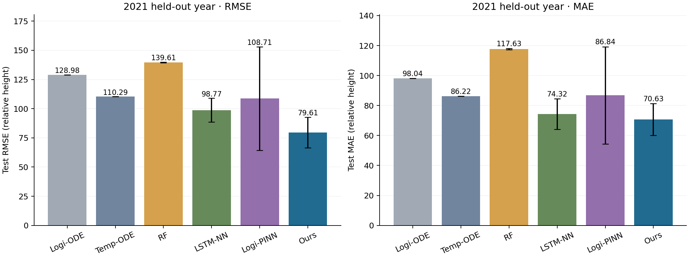
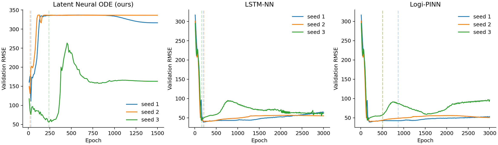
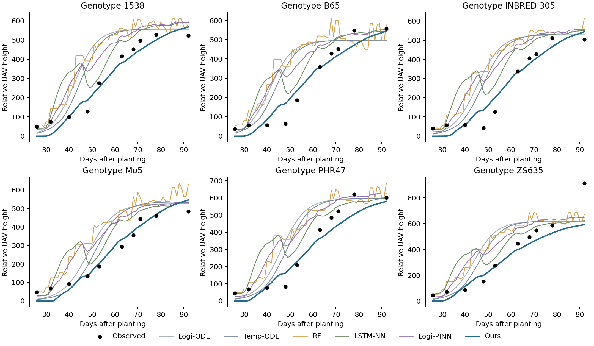

# 옥수수 모델 비교 결과

고정 분할: 학습 2018–2019 / 검증 2020 / 시험 2021.
402개 유전자형, 학습 시험구 1,533개, 검증/시험 각각 유전자형 평균 곡선 402개.
수치는 원래 **상대 UAV 높이 단위**이며 cm/m가 아니다. 낮을수록 좋다.

| 모델 | 학습 RMSE | 검증 RMSE | 시험 RMSE | 시험 MAE | 실행 수 | 파라미터 |
|---|---:|---:|---:|---:|---:|---:|
| Logi-ODE | 47.286 | 124.625 | 128.982 | 98.043 | 1 | 804 |
| Temp-ODE | 47.346 | 110.118 | 110.294 | 86.222 | 1 | 806 |
| RF | 7.031 ± 0.005 | 131.776 ± 0.948 | 139.608 ± 0.310 | 117.628 ± 0.369 | 3 | 해당 없음 (RF) |
| LSTM-NN | 42.621 ± 1.730 | 40.922 ± 2.209 | 98.767 ± 10.196 | 74.323 ± 10.147 | 3 | 2,366 |
| Logi-PINN | 33.182 ± 2.072 | 48.145 ± 8.372 | 108.705 ± 44.420 | 86.839 ± 32.428 | 3 | 3,170 |
| Latent Neural ODE (ours) | 57.531 ± 19.402 | 99.242 ± 38.659 | 79.611 ± 13.117 | 70.626 ± 10.611 | 3 | 3,187 |

RF와 신경망은 시드 1·2·3의 평균 ± 표본 표준편차다. 결정론적인 두 process baseline은 1회 적합했다.
표준편차는 시드 변동이며 유전자형/환경에 대한 신뢰구간이 아니다.

시험 RMSE가 가장 낮은 baseline은 **LSTM-NN**이며, 우리 모델의 상대 RMSE 감소율은 **19.40%**다. 음수이면 우리 모델의 오차가 더 크다는 뜻이다.

## 평가 방식과 해석

각 유전자형 곡선에서 실제 관측점의 RMSE/MAE를 계산한 뒤 402개 곡선을 동일 가중 평균했다.
학습 지표도 두 학습 연도의 유전자형 평균 804개 곡선에 대해 계산했다.
관측이 없는 날짜는 평가하지 않았고, 반복 평균은 해당 날짜에 존재하는 시험구만 사용했다.
`comparison.csv`의 pooled RMSE는 모든 관측점을 합친 보조 지표로, 주 지표와 구별한다.

모델 선택은 매 10 epoch 측정한 2020년 검증 RMSE가 가장 낮은 checkpoint로 했다. 이동평균은 사용하지 않았다.
Latent ODE와 LSTM은 첫 평가부터, PINN은 500 epoch warm-up 후 물리 손실이 실제 적용된 checkpoint부터 선택했다. 초기 설정 점검의 검증 이력에서 기존 작물의 최소 epoch/이동평균 조건이 더 좋은 초기 checkpoint를 제외하는 것을 확인하여 그 제한을 제거했다. 변경은 검증 이력에만 근거했고, 설정 점검 실행은 최종 비교표에서 제외했다.
신경망마다 정해진 전체 epoch 예산을 실행한 후 선택된 체크포인트로 시험 데이터를 평가했다.
신경망 checkpoint 선택과 hyperparameter 설정에 시험 결과를 사용하지 않았다.
이 결과는 한 개 시험 연도에서의 초기 비교이며, 다른 연도 분할에 대한 일반화나 통계적 우위를 확정하지 않는다.

## 모델 설정

- Latent Neural ODE: 기존 밀 최종 설정을 재사용했다. latent 16, genotype embedding 4, ODE hidden 16×1, decoder 16, encoder 8, calendar time, RK4 1 substep, Adam lr 0.01, L2 1e-4, cosine schedule, physics 2, ymax 0.1, 1,500 epoch.
- LSTM-NN / Logi-PINN: 기존 reference 구조(두 LSTM의 hidden 5/3, genotype embedding 5, head 5), 3,000 epoch, Adam lr 0.001, normalized non-bias L2 1.
- Logi-PINN: 옥수수 학습 데이터에서 적합한 genotype별 r/K로 초기화, direct r/K, ODE lr 0.0001, 500 epoch warm-up 동안 r/K 고정. 기존 reference의 time-autograd 손실과 physics weight 2를 유지했다.
- Logi-ODE: genotype별 r/K 2개를 학습 관측값으로 적합했다. 초기값 3개 중 학습 잔차가 최소인 적합을 선택했다. 고정 H0=1e-4는 기존 실험과 동일한 정규화 높이 단위의 가정이며, 실제 초기 높이 관측값을 뜻하지 않는다.
- Temp-ODE: genotype별 r/K와 전체 공통 온도 반응 임계값 2개를 적합했다. 일정 온도를 가정한 기존 애기장대 구현을 옥수수의 일별 기온에 맞춰 수정해 반응을 사다리꼴 적분했다. 온도 임계값의 순서는 bounds로 보장한다.
- RF: 100 trees, genotype one-hot + 해당 일의 기온 + 정규화 시간. 성장 이력을 직접 인코딩하는 구조는 아니다.
- Process 모델과 RF는 시험구별 관측 수의 역수로 가중해 관측이 많은 시계열의 과도한 기여를 줄였다. 신경망은 시험구별 RMSE의 평균을 학습했다. 모델별 본래 목적함수는 다르지만 평가 지표는 같다.

Logi-PINN의 기존 구현은 `autograd(prediction.sum(), time)`을 사용한다. recurrent 출력에서는 이 값이 각 출력의 자기 시점 미분만을 추출한 Jacobian 대각과 다를 수 있다. 이번 비교는 저장소 baseline의 구현을 유지한 재현이며, 이 미분 정의를 새로 검증한 물리 모델이라고 해석하지 않는다.

모든 모델은 학습 연도에서 계산한 높이/기온 스케일과 동일한 관측 마스크를 사용한다. 기상 자료는 전 생육기에 대해 알려져 있는 조건이며 실시간 미래 날씨 예보 실험은 아니다.

## 산출물과 검증

- `all_runs.csv`: 14개 실행의 개별 결과·선택 epoch·시간·GPU 정보.
- `comparison.csv`: 전체 지표의 평균·표준편차 비교표.
- `per_curve_metrics.csv`: 모델/시드/유전자형/연도별 오차.
- `observed_predictions.csv.gz`: 실제 관측점에서의 정답과 예측.
- `runs/*/`: 각 실행의 전체 격자 예측, 체크포인트 또는 RF 모델, 학습 이력.
- `logistic_parameters.json`, `temperature_parameters.json`: 학습 데이터에 적합한 process 파라미터.
- `protocol.json`: 설정과 실행 코드·입력 파일 SHA-256.
- `validation.json`: 저장 예측으로 지표를 재계산하고 검증 checkpoint 선택을 확인한 기록.

예시 유전자형은 정렬된 ID 목록의 균등 간격으로 선택했다. 예측은 시드 평균이고, 각 곡선의 첫/마지막 실제 관측 사이에서만 표시한다.
