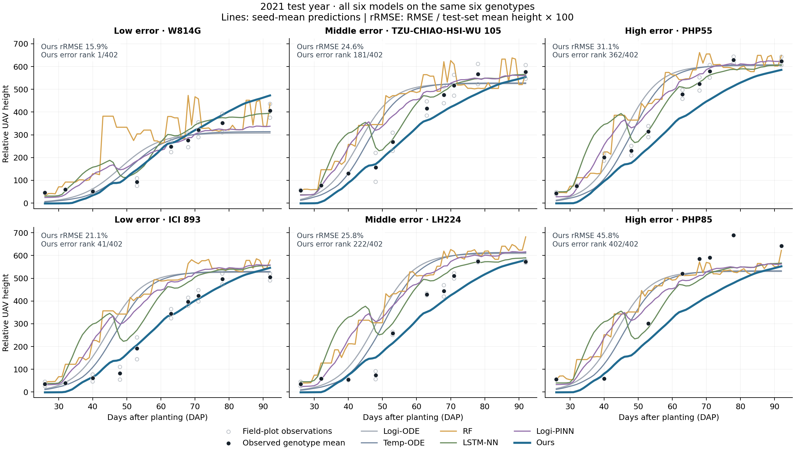
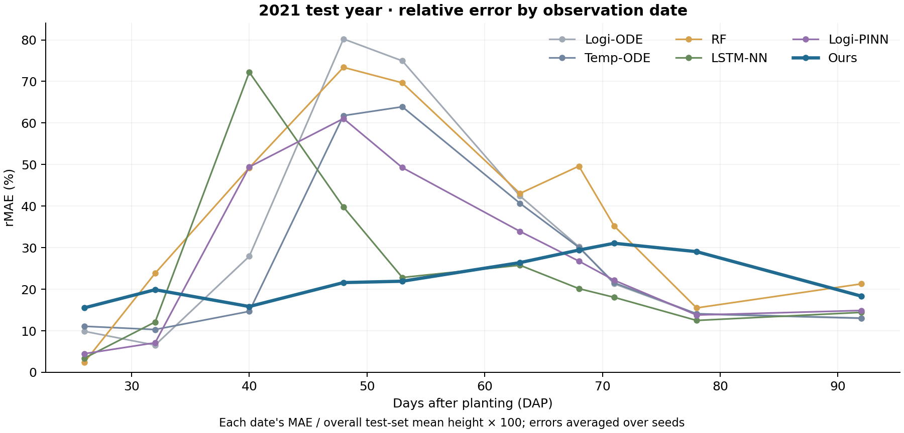
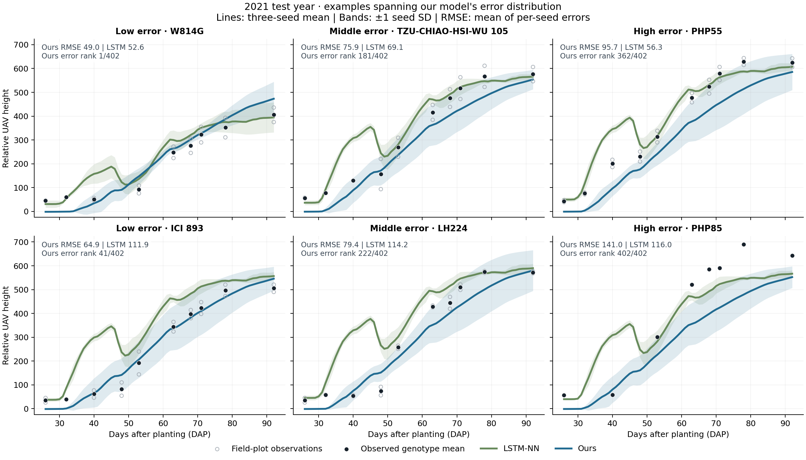
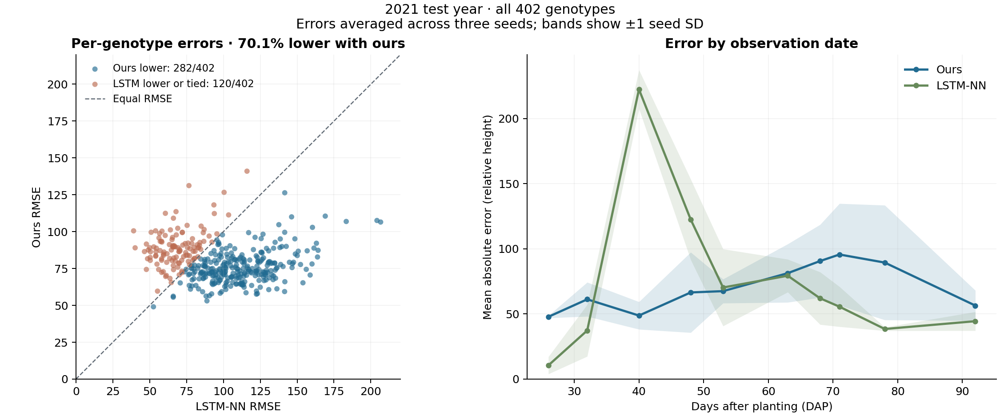

# 추가 예측 그림

2021년 시험 데이터, 402개 유전자형. 기존 최종 실험의 저장 예측만 사용했다.

## 전체 baseline 성장 곡선



앞서 선택한 동일한 6개 유전자형에 Logi-ODE, Temp-ODE, RF, LSTM-NN, Logi-PINN, 우리 모델을 모두 표시했다. 결정론적 ODE는 1회 적합 예측, 나머지는 시드 1–3의 평균이다. 이 그림에서는 겹침을 줄이기 위해 띠를 생략했다.
패널 rRMSE는 시드별 RMSE 평균을 전체 시험 평균 높이 308.087490로 나누고 100을 곱했다. 패널마다 다른 높이를 분모로 쓰지 않는다. y축은 원래 상대 UAV 높이 단위다.



rMAE는 날짜별 MAE를 동일한 전체 시험 평균 높이로 나눈 백분율이다. 관측일 사이 선은 시각적 안내다.

## 시드 변동을 포함한 LSTM/우리 모델 성장 곡선



유전자형별 우리 모델의 3개 시드 RMSE 평균을 오름차순으로 정렬하고, 0·10·45·55·90·100% 위치에서 선택했다. 동률은 유전자형 ID로 정렬하며, 순위 인덱스는 `round(q * (N-1))`다. 낮은 오차/중간 오차/높은 오차를 열별로 배치했다. 사후 진단용 선택이며 모델 선택에는 사용하지 않았다.

검은 점은 해당 날짜의 유전자형별 반복 시험구 평균이며 평가 대상이다. 회색 빈 점은 개별 시험구 관측값으로, 개체별 식물 높이가 아니다. 선은 세 시드 예측의 평균, 띠는 시드 간 표본 표준편차 ±1이다. 띠는 예측 신뢰구간이 아니며, 관측 변동과도 구별한다. 예측은 첫 관측일부터 마지막 관측일까지만 표시한다.

패널의 RMSE는 시드별 RMSE를 먼저 계산한 뒤 평균한 값이다. 시드 평균 예측선 자체의 RMSE와 다르며, 기존 비교표와 같은 집계 방식이다. 상대 UAV 단위이며 cm/m가 아니다.

## 전체 시험 집합 오차



왼쪽: 점 하나는 유전자형 하나이며, 대각선 아래는 우리 모델의 오차가 더 작은 경우다. 전체 402개 중 282개(70.1%)에서 우리 모델의 시드 평균 RMSE가 낮다.

오른쪽: 날짜별로 관측이 있는 유전자형들의 MAE를 각 시드에서 계산하고, 세 시드의 평균과 표준편차를 표시했다. 날짜 사이 연결선은 시각적 안내이며, 관측 없는 날짜에서 평가한 결과가 아니다.

LSTM-NN은 최종 비교표에서 시험 RMSE가 가장 낮은 baseline이다. 이 그림은 동일한 2021년 시험 결과의 진단이며 다른 연도에 대한 우위를 뜻하지 않는다.

## 파일과 재현

- 모든 그림은 같은 이름의 PDF로도 저장했다.
- `selected_genotypes.csv`: 선택 ID, 오차, 전체 순위, 분위 위치.
- `paired_genotype_errors.csv`: 전체 유전자형의 LSTM/우리 모델 시드 평균 RMSE.
- `daily_errors.csv`: 모델·시드·관측일별 MAE와 관측 유전자형 수.
- `all_model_genotype_relative_errors.csv`: 402개 유전자형, 전체 모델의 시드 평균 rRMSE.
- `test_examples.png`: 기존 유전자형 ID 기준 균등 선택 예시, 전체 6개 모델 비교.

프로젝트 루트에서:

```bash
OPENBLAS_NUM_THREADS=1 OMP_NUM_THREADS=1 .venv/bin/python maize/code/plot_predictions.py
```

그림 생성 전 실험 코드·입력 SHA-256을 확인했고, 6개 모델의 모든 유전자형·시드 RMSE를 저장 예측으로 재계산해 원래 표와 일치함을 확인했다.
