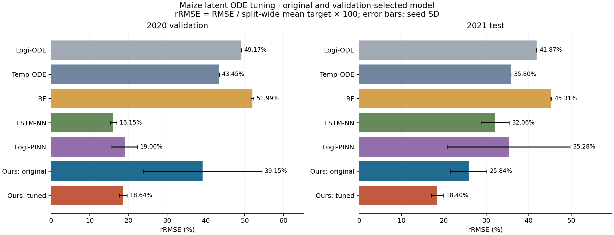
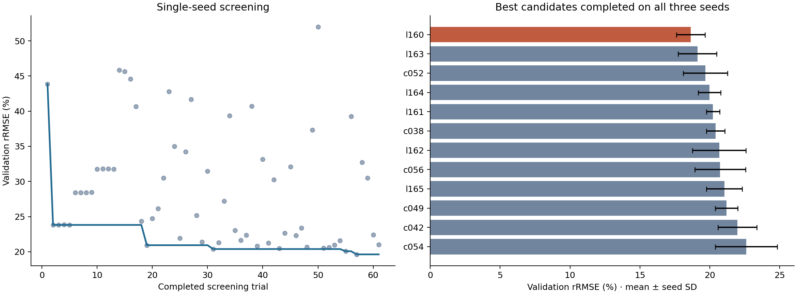
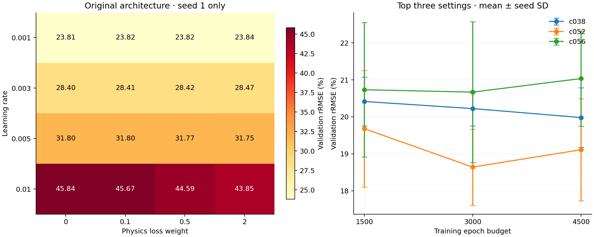
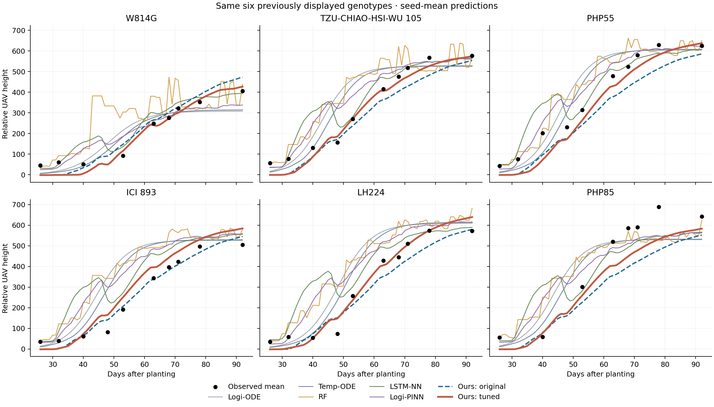

# 옥수수 우리 모델 하이퍼파라미터 튜닝

완료 실행 95회, 평가한 설정 67개, 3개 시드를 모두 완료한 설정 14개. 검색 시작 후 약 180.0분.

학습 2018–2019 / 검증 2020 / 시험 2021. 후보 탐색에는 검증 RMSE만 사용했다. 전체 학습을 완료한 시드 1–3의 검증 RMSE 평균이 가장 낮은 설정을 먼저 확정하고, 확정된 세 체크포인트만 시험 평가했다. 시험 결과를 보고 설정이나 시드를 다시 고르지 않았다.

이번 탐색은 우리 모델에만 적용했다. baseline 행은 기존 완료 실험의 고정 결과이며, 모델마다 동일한 하이퍼파라미터 탐색 예산을 준 비교는 아니다.

선택 설정: `l160`, 검증 rRMSE **18.64 ± 1.03%**.

선택 모델의 파라미터 수는 **9,003개**다. 기존 옥수수 모델은 3,187개이며, 이번 탐색에는 네트워크 크기 변경도 포함했다.

```json
{
  "latent_dim": 8,
  "g_embed_dim": 8,
  "ode_hidden": 16,
  "ode_layers": 1,
  "dec_hidden": 32,
  "enc_hidden": 32,
  "time_mode": "calendar",
  "lr": 0.01,
  "weight_decay": 0.0001,
  "physic": 0.5,
  "ymax": 0.5,
  "mono": 0.0,
  "epochs": 3000
}
```

[선택 설정](../configs/l160.json) · [선택 기록·해시](../selected.json) · [시드 1 체크포인트](../trials/l160/seed1/checkpoint.pt) · [시드 2 체크포인트](../trials/l160/seed2/checkpoint.pt) · [시드 3 체크포인트](../trials/l160/seed3/checkpoint.pt)

| 모델 | 검증 rRMSE (%) | 시험 rRMSE (%) | 시험 rMAE (%) |
|---|---:|---:|---:|
| Logi-ODE | 49.17 | 41.87 | 31.82 |
| Temp-ODE | 43.45 | 35.80 | 27.99 |
| RF | 51.99 ± 0.37 | 45.31 ± 0.10 | 38.18 ± 0.12 |
| LSTM-NN | 16.15 ± 0.87 | 32.06 ± 3.31 | 24.12 ± 3.29 |
| Logi-PINN | 19.00 ± 3.30 | 35.28 ± 14.42 | 28.19 ± 10.53 |
| Latent Neural ODE (ours) | 39.15 ± 15.25 | 25.84 ± 4.26 | 22.92 ± 3.44 |
| Latent Neural ODE (tuned) | 18.64 ± 1.03 | 18.40 ± 1.42 | 15.84 ± 1.01 |

선택 설정의 시드별 결과:

| 시드 | 학습 예산 (epoch) | 선택 checkpoint (epoch) | 검증 rRMSE (%) | 시험 rRMSE (%) |
|---|---:|---:|---:|---:|
| 1 | 3000 | 190 | 19.65 | 20.02 |
| 2 | 3000 | 730 | 17.60 | 17.39 |
| 3 | 3000 | 910 | 18.67 | 17.79 |

기존 우리 모델 대비 검증 RMSE 감소율 52.39%, 시험 RMSE 감소율 28.80% (음수는 오차 증가). rRMSE는 각 분할의 평균 평가 높이로 나눈 백분율이다. 원단위 RMSE/MAE도 comparison.csv에 함께 보관했다. 원단위는 상대 UAV 높이이며 cm/m가 아니다. ±는 3개 시드의 표준편차다.

각 유전자형 곡선의 관측 지점에서 RMSE/MAE를 계산한 뒤 곡선 간 평균을 취했다. 이 평균 오차를 해당 분할의 전체 관측 높이 평균으로 나누고 100을 곱해 rRMSE/rMAE를 산출했다. 분모는 relative_error_denominators.json에 기록했다.

2020년 한 해에 대한 반복 탐색이므로 검증 최저값 자체에는 선택 편향이 있다. 2021년 시험 결과는 이 고정 설정의 한 연도 평가이며 여러 연도에 대한 우위를 확정하지 않는다.







학습률·물리 손실 격자는 기존 구조에서 나머지 설정을 고정한 시드 1 비교다. 학습 길이 비교는 각 설정의 시드 1–3을 처음부터 다시 학습한 결과이며, epoch 예산에 따라 cosine 학습률 스케줄도 함께 달라진다.



예측 예시는 튜닝 전에 표시했던 동일한 유전자형 6개다. 첫 관측일부터 마지막 관측일까지만 표시했다.

원래 비교 결과는 `chronological_final_seed1_3`에 보존했다. 최종 체크포인트는 상위 폴더 `selected.json`의 후보/시드 경로와 SHA-256으로 고정되어 있다.
