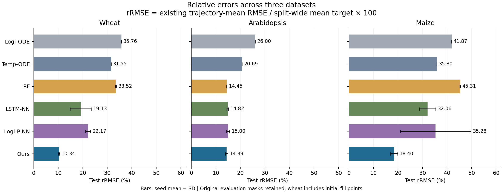

# 세 데이터셋 상대오차 비교

메인 `Ours` 행은 각 데이터셋에서 현재 채택한 결과를 사용한다. 옥수수는 2020년 검증 평균으로 선택한 3,000-epoch 튜닝 모델로 업데이트했다. 옥수수 baseline은 기존 결과를 유지했으며, 튜닝 전 우리 모델은 아래 전체 분할 표에 `Ours (before maize tuning)`으로 보존했다.

## 지표 정의

**rRMSE(%) = 기존 RMSE / 해당 평가셋의 평균 평가 타깃 × 100**

rMAE도 같은 분모를 사용한다. 기존 RMSE는 각 곡선의 마스크 내 RMSE를 계산한 뒤 곡선을 동일 가중 평균한 값이다. 분모는 반복 평균한 평가 곡선들의 `mask=1` 타깃 전체를 모아 산술평균한 값이다. 각 데이터셋·분할에서 모든 모델과 시드에 같은 분모를 적용하므로 모델 순위는 바뀌지 않는다. 곡선마다 각각 정규화한 평균이나 점별 MAPE와는 다른 지표다.

분모는 지표를 보고하기 위한 값이며 모델 학습·체크포인트 선택·예측에는 사용하지 않았다. 학습/검증/시험은 각 분할 자체의 분모를 사용한다. 다른 작물의 물리 단위는 백분율 계산에서 소거된다.

## 시험 RMSE / relative error (%)

각 셀의 첫 값은 원단위 RMSE, 두 번째 값은 rRMSE(%)다.

| 모델 | 밀 (m / %) | 애기장대 (cm / %) | 옥수수 (relative UAV unit / %) |
|---|---:|---:|---:|
| Logi-ODE | 0.10590 / 35.76 | 5.179 / 26.00 | 128.98 / 41.87 |
| Temp-ODE | 0.09343 / 31.55 | 4.121 / 20.69 | 110.29 / 35.80 |
| RF | 0.09929 ± 0.00047 / 33.52 ± 0.16 | 2.878 ± 0.010 / 14.45 ± 0.05 | 139.61 ± 0.31 / 45.31 ± 0.10 |
| LSTM-NN | 0.05667 ± 0.01274 / 19.13 ± 4.30 | 2.951 ± 0.064 / 14.82 ± 0.32 | 98.77 ± 10.20 / 32.06 ± 3.31 |
| Logi-PINN | 0.06567 ± 0.00306 / 22.17 ± 1.03 | 2.987 ± 0.126 / 15.00 ± 0.63 | 108.71 ± 44.42 / 35.28 ± 14.42 |
| **Ours** | **0.03063 ± 0.00062 / 10.34 ± 0.21** | **2.866 ± 0.093 / 14.39 ± 0.47** | **56.68 ± 4.37 / 18.40 ± 1.42** |



평균 ± 표본 표준편차, 시드 1–3. 결정론적 Logi-ODE/Temp-ODE는 1회 적합. 표준편차는 시드 변동이며 데이터셋 일반화에 대한 신뢰구간이 아니다.
밀의 Logi-ODE/Temp-ODE/RF는 동일한 기존 분할·마스크를 사용해 추가로 학습한 결과다. 실행 설정·예측·검증은 `wheat/results/additional_baselines_seed1_3/`에 저장했다. 밀 LSTM-NN/Logi-PINN reference는 원저자 출력 CSV의 첫 3개 시드이며, 원본 RMSE가 0.001 m 단위로 반올림되어 있으므로 상대오차의 원자료 정밀도도 그 제한을 받는다.

## 시험 rMAE (%)

| 모델 | 밀 | 애기장대 | 옥수수 |
|---|---:|---:|---:|
| Logi-ODE | 22.48 | 22.60 | 31.82 |
| Temp-ODE | 19.68 | 17.57 | 27.99 |
| RF | 18.21 ± 0.11 | 11.79 ± 0.01 | 38.18 ± 0.12 |
| LSTM-NN | — | 12.56 ± 0.13 | 24.12 ± 3.29 |
| Logi-PINN | — | 12.67 ± 0.32 | 28.19 ± 10.53 |
| Ours | 6.76 ± 0.13 | 12.37 ± 0.44 | 15.84 ± 1.01 |

밀 우리 모델의 시험 MAE는 저장된 세 시드 예측에서 계산했다. 추가 학습한 Logi-ODE/Temp-ODE/RF도 MAE를 저장했다. 밀 LSTM-NN/Logi-PINN의 기존 reference 출력에는 MAE가 없어 해당 칸은 `—`로 남겼다.

## 평가 분모와 분할

| 데이터셋 | 시험 분할 | 곡선 수 | 평가점 수 | 평균 평가 타깃 |
|---|---|---:|---:|---:|
| Wheat | 2021년 | 19 | 1368 | 0.296187 m |
| Arabidopsis | 개체 9–10, 반복 평균 | 18 | 72 | 19.915278 cm |
| Maize | 2021년 | 402 | 3973 | 308.087490 relative UAV height |

**밀은 기존 reference 평가를 유지하므로 시험 평가점 1368개 중 475개가 최초 관측 전 채움값이다.** 이 점들은 기존 RMSE와 이번 분모에 모두 포함된다. 애기장대와 옥수수는 실제 관측 마스크만 사용한다. 따라서 세 작물의 숫자는 단위를 제거한 기존 벤치마크 결과이며, 동일한 관측 조건의 난이도 비교로 해석하지 않는다. 밀·옥수수는 연도 분할, 애기장대는 같은 유전자형·온도 내 새 개체 분할이다.

## 학습·검증·시험 rRMSE (%) — 기존 변형 포함

| 데이터셋 | 모델 | 학습 | 검증 | 시험 |
|---|---|---:|---:|---:|
| Wheat | Ours | 7.50 ± 0.06 | 11.41 ± 0.20 | 10.34 ± 0.21 |
| Wheat | LSTM-NN | 11.47 ± 0.19 | 22.20 ± 3.13 | 19.13 ± 4.30 |
| Wheat | Logi-PINN | 11.47 ± 0.84 | 19.90 ± 0.96 | 22.17 ± 1.03 |
| Wheat | Logi-ODE | 32.50 | 17.97 | 35.76 |
| Wheat | Temp-ODE | 30.01 | 17.23 | 31.55 |
| Wheat | RF | 1.63 ± 0.05 | 26.43 ± 0.02 | 33.52 ± 0.16 |
| Arabidopsis | Logi-ODE | 23.50 | 26.19 | 26.00 |
| Arabidopsis | Temp-ODE | 17.48 | 20.73 | 20.69 |
| Arabidopsis | RF | 0.73 ± 0.08 | 15.97 ± 0.04 | 14.45 ± 0.05 |
| Arabidopsis | LSTM-NN | 8.09 ± 0.58 | 16.60 ± 0.51 | 14.82 ± 0.32 |
| Arabidopsis | Ours | 6.66 ± 0.42 | 16.12 ± 0.03 | 14.39 ± 0.47 |
| Arabidopsis | Logi-PINN | 8.18 ± 0.16 | 16.47 ± 0.37 | 15.00 ± 0.63 |
| Maize | Logi-ODE | 15.15 | 49.17 | 41.87 |
| Maize | Temp-ODE | 15.17 | 43.45 | 35.80 |
| Maize | RF | 2.25 ± 0.00 | 51.99 ± 0.37 | 45.31 ± 0.10 |
| Maize | LSTM-NN | 13.66 ± 0.55 | 16.15 ± 0.87 | 32.06 ± 3.31 |
| Maize | Logi-PINN | 10.63 ± 0.66 | 19.00 ± 3.30 | 35.28 ± 14.42 |
| Maize | Ours (before maize tuning) | 18.44 ± 6.22 | 39.15 ± 15.25 | 25.84 ± 4.26 |
| Maize | Ours | 13.43 ± 4.61 | 18.64 ± 1.03 | 18.40 ± 1.42 |
| Wheat | Micro Latent Neural ODE | 8.26 ± 0.21 | 12.46 ± 1.16 | 11.11 ± 0.47 |
| Wheat | Original Latent Neural ODE | 7.71 ± 0.21 | 12.63 ± 0.76 | 10.68 ± 0.07 |

## 산출물과 재현

- `relative_error_summary.csv`: 전체 모델·분할의 원단위 오차, 상대오차 평균/표준편차, 분모와 평가점 수.
- `per_run_relative_errors.csv`: 저장된 개별 시드 결과의 상대오차. 요약 표만 있는 밀의 Micro/Original 변형은 제외.
- `denominators.csv`: 정규화 분모와 실제 관측 없는 평가점 수.
- `provenance.json`: 사용한 입력 파일과 SHA-256.
- `test_relative_errors.png` / `.pdf`: 시험 rRMSE 비교 그림.
- `test_rmse_relative_table.tex`: 각 셀을 `RMSE / relative error (%)`로 표시하고 데이터셋별 최저 결과를 굵게 한 LaTeX 표.
  `paper/main.tex`에서는 `\input{relative_errors/test_rmse_relative_table.tex}`로 삽입할 수 있다. 현재 원고에 이미 포함된 `booktabs`, `graphicx` 패키지를 사용한다.

```bash
OPENBLAS_NUM_THREADS=1 OMP_NUM_THREADS=1 .venv/bin/python paper/relative_errors.py
```
